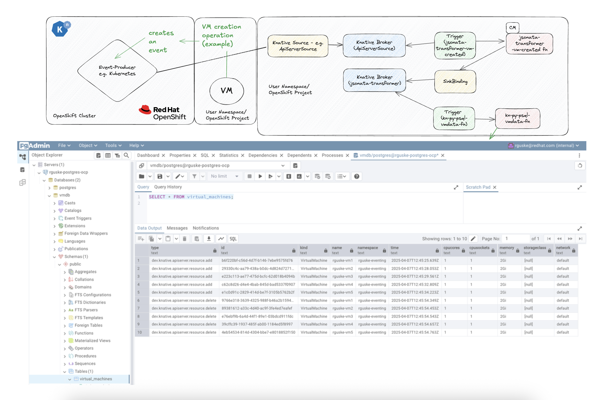
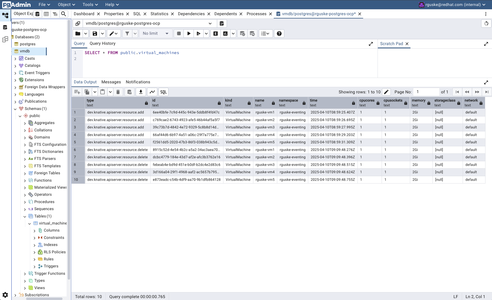

# OpenShift Virtualization/KubeVirt PostgreSQL Knative Function Example

This function is based on a real customer use case. The idea is to update a database every time a virtual machine got created. Important to understand is, that this particular function relies on a new feature in Knative Eventing, which is called [Event Transformer](https://knative.dev/development/eventing/transforms/).

Event-driven systems like Kubernetes produce a massive amount of events based on each operation that happens like deploying an app or starting a Virtual Machine. The challenge with these events? They are data-heavy and cumbersome and making downstream processing tricky. The Knative Event-Transformer functionality trims the fat and delivers exactly what your function needs. Here's an example of a transformed event:

```json
{
    "specversion": "1.0",
    "type": "dev.knative.apiserver.resource.add",
    "source": "https://172.30.0.1:443",
    "subject": "/apis/kubevirt.io/v1/namespaces/rguske-eventing/virtualmachines/rhel9-eventing-robert-1",
    "id": "680e7dd2-2f41-456f-8b75-6f95f85ca5a1",
    "time": "2025-02-16T18:36:04.391Z",
    "kind": "VirtualMachine",
    "name": "rhel9-eventing-robert-1",
    "namespace": "rguske-eventing",
    "cpucores": 6,
    "cpusockets": 1,
    "memory": "1536Mi",
    "storageclass": "my-storageclass",
    "network": "default"
}
```

Basic process:

A VM creation operation happened -- the Kubernetes API Server creates an event -- the Knative `ApiServerSource` forwards the event to a Knative `Broker` -- the Broker fans out the events -- a `Trigger` is used to filter for specific events like e.g. `dev.knative.apiserver.resource.add` -- the `Event Transformer` function transforms the event payload and forwards it to e.g. a `Sink` -- the `Sink` feats another `Broker` (or another function) -- another `Trigger` is used to ultimately invoke the `kn-py-psql-vmdata` Function.



## Build the Function

Clone the repository using `git clone` and change into the root of the cloned directory.

- Specify an image name:

```code
export IMAGE="quay.io/rguske/kn-py-psql-vmdata-fn:v1.0"
```

- Create the container image:

```code
podman build -t ${IMAGE} -f Containerfile
```

## Test the funtion

- Run the function locally:

```code
podman run -e PORT=8080 -it \
--rm -p 8080:8080 \
--env-file test/test-env-variables \
${IMAGE}
```

- Alternatively:

```code
podman run -e PORT=8080 -it \
--rm -p 8080:8080 \
--env DB_HOST='10.32.98.110' \
--env DB_PORT='5432' \
--env DB_NAME='vmdb' \
--env DB_USER='postgres' \
--env DB_PASSWORD='redhat' \
${IMAGE}
```

You should see an output similar to:

```code
 * Serving Flask app 'handler'
 * Debug mode: on
WARNING: This is a development server. Do not use it in a production deployment. Use a production WSGI server instead.
 * Running on all addresses (0.0.0.0)
 * Running on http://127.0.0.1:8080
 * Running on http://10.88.0.6:8080
Press CTRL+C to quit
 * Restarting with stat
 * Debugger is active!
 * Debugger PIN: 853-344-784
```

- Pass the test event-payload:

```code
curl -X POST http://localhost:8080/ -H "Content-Type: application/json" -d @test/testevent.json

📥 Received POST request
Headers: {'Host': 'localhost:8080', 'User-Agent': 'curl/8.7.1', 'Accept': '*/*', 'Content-Type': 'application/json', 'Content-Length': '2935'}
Content-Type: application/json
CloudEvent ID: None
Transformed data: {'type': None, 'id': None, 'kind': None, 'name': None, 'namespace': None, 'time': None, 'cpucores': 0, 'cpusockets': 0, 'memory': None, 'storageclass': None, 'network': None}
✅ Event None processed in 0.74 seconds
192.168.127.1 - - [11/Apr/2025 14:21:16] "POST / HTTP/1.1" 200 -
```

You'll (hopefully) receive a `success` message:

```code
{
  "status": "\u2705 success"
}
```

The function logic also includes skipping duplicated events. If you'd send the event twice, you'll see:

```code
📥 Received POST request
Headers: {'Host': 'localhost:8080', 'User-Agent': 'curl/8.7.1', 'Accept': '*/*', 'Content-Type': 'application/json', 'Content-Length': '533'}
Content-Type: application/json
CloudEvent ID: None
🟡 Duplicate event detected, skipping: None
192.168.127.1 - - [11/Apr/2025 14:30:30] "POST / HTTP/1.1" 200 -
```

and

```code
{
  "reason": "duplicate event",
  "status": "skipped"
}
```

## Deploy the Function

**IMPORTANT**: The deployment of this function assumes a working Knative environment as well as the configured `Event Transformer` CR. A blog post on "How To" is in the making.

Push the newly created image to a working Container Image Registry instance.

```code
podman push ${IMAGE}
```

- Create the secret, which includes the DB data:

```code
kubectl create secret generic psql-secret \
  --from-literal=db_host="changeme" \
  --from-literal=db_port="changeme" \
  --from-literal=db_name="changeme" \
  --from-literal=db_user="changeme" \
  --from-literal=db_password="changeme"
```

Within the `function.yaml`, you have to adjust multiple sections accordingly to your environment. First ist the container image if you have changed it.

```yaml
    spec:
      containers:
        - image: quay.io/rguske/kn-py-psql-vmdata-fn:v1.0
```

Per default, the `trigger`s are configured on the events `dev.knative.apiserver.resource.add` as well as `dev.knative.apiserver.resource.delete`. Adjust these if necessary.

Make sure to change the name for the `broker` as well.

```yaml
  labels:
    eventing.knative.dev/broker: inmem-broker-transformer
spec:
  broker: inmem-broker-transformer
```

- Deploy the function:

```code
oc apply -f function.yaml
```

## Delete the Function

- Deleting the function:

```code
oc delete -f function.yaml
```

## Validating the Functionality

If you have a working environment running a PostgreSQL, you can nicely validate the if it works as expected.

I've simply created multiple VMs using:

`for i in $(seq 1 5);  do oc process -n openshift rhel9-server-medium  -p NAME=vm${i} | oc apply -f - ; done;`

I assume you've created the DB, the table and the columns accordingly beforehand.

Connect to the DB using `psql`:

```code
psql -U postgres -h 10.32.98.110 -p 5432 -d vmdb -c 'SELECT * FROM "virtual_machines"'

Password for user postgres:
                 type                  |                  id                  |      kind      |    name    |    namespace    |           time           | cpucores | cpusockets | memory | storageclass | network
---------------------------------------+--------------------------------------+----------------+------------+-----------------+--------------------------+----------+------------+--------+--------------+---------
 dev.knative.apiserver.resource.add    | 6ee40bfe-7c9d-445c-943e-5ddb8f4fd47c | VirtualMachine | rguske-vm1 | rguske-eventing | 2025-04-10T08:59:25.407Z | 1        | 1          | 2Gi    |              | default
 dev.knative.apiserver.resource.add    | c769cae2-6743-4923-afe5-46b44af5a5f7 | VirtualMachine | rguske-vm2 | rguske-eventing | 2025-04-10T08:59:26.695Z | 1        | 1          | 2Gi    |              | default
 dev.knative.apiserver.resource.add    | 39c73b7d-4842-4e72-9329-5c8b8d14d12f | VirtualMachine | rguske-vm3 | rguske-eventing | 2025-04-10T08:59:27.995Z | 1        | 1          | 2Gi    |              | default
 dev.knative.apiserver.resource.add    | 66af44d6-6b97-4a51-a06c-29f7a775e78b | VirtualMachine | rguske-vm4 | rguske-eventing | 2025-04-10T08:59:29.203Z | 1        | 1          | 2Gi    |              | default
 dev.knative.apiserver.resource.add    | f2561dd5-2020-47b3-86f3-038b943c5d10 | VirtualMachine | rguske-vm5 | rguske-eventing | 2025-04-10T08:59:31.309Z | 1        | 1          | 2Gi    |              | default
 dev.knative.apiserver.resource.delete | 8915c52d-4e54-4b2c-a5a2-34ac3aea70d9 | VirtualMachine | rguske-vm1 | rguske-eventing | 2025-04-10T09:09:48.276Z | 1        | 1          | 2Gi    |              | default
 dev.knative.apiserver.resource.delete | dcbc4779-184e-43d7-af2e-afc3b3762e16 | VirtualMachine | rguske-vm2 | rguske-eventing | 2025-04-10T09:09:48.396Z | 1        | 1          | 2Gi    |              | default
 dev.knative.apiserver.resource.delete | febeab4e-bd9d-451e-b0df-b2dc4e2d83c6 | VirtualMachine | rguske-vm3 | rguske-eventing | 2025-04-10T09:09:48.515Z | 1        | 1          | 2Gi    |              | default
 dev.knative.apiserver.resource.delete | 3d166a04-29f1-4968-aaf2-ac5657b79570 | VirtualMachine | rguske-vm4 | rguske-eventing | 2025-04-10T09:09:48.624Z | 1        | 1          | 2Gi    |              | default
 dev.knative.apiserver.resource.delete | e873eadc-c54b-4df9-aa70-9b1dfb864128 | VirtualMachine | rguske-vm5 | rguske-eventing | 2025-04-10T09:09:48.755Z | 1        | 1          | 2Gi    |              | default
(10 rows)
```

### Running pgAdmin locally as a Container

Alternatively to `psql` you can run a **pgAdmin** instance locally as a container. Simply run...

```code
podman run -p 80:80 \
    -e 'PGADMIN_DEFAULT_EMAIL=rguske@redhat.com' \
    -e 'PGADMIN_DEFAULT_PASSWORD=redhat' \
    -d dpage/pgadmin4:9.2.0
```

...and establish a connection to your DB accordingly.

Query the DB using `SELECT * FROM "virtual_machines"`


